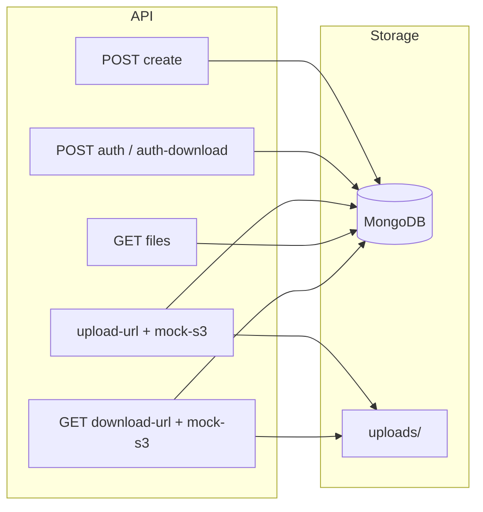

# File Upload / Download Service – Backend

Hono API that powers the **share** flow: create a share (upload + download links and passwords), authenticate with either password, and upload/download files via signed URLs. File bytes are stored on disk; metadata is in MongoDB.

## What this API does

- **Create share** – `POST /file-requests` with upload and download passwords (and optional name). Returns two links (`/share/:id` and `/share/:id/download`) and the two passwords.
- **Auth** – `POST /file-requests/:id/auth` (upload password) or `POST /file-requests/:id/auth-download` (download password). Returns a JWT for subsequent requests.
- **Upload** – Single-part (upload-url + upload-complete) or multipart (init → part-url → complete). “Signed” URLs point at this backend’s mock S3 routes; files are written to disk. The client shows upload progress (percentage) and uploads files in parallel.
- **Files** – List files, get download URL for a file, delete a file (with correct role).

## Mock S3 and signed URLs

The backend **mocks an S3 client**: there is no AWS SDK. Instead:

- **File-requests API** calls `services/mockS3` to get **mock signed URLs**. Each URL is this backend’s own base URL (e.g. `http://localhost:3001`) plus a path like `/mock-s3/upload` or `/mock-s3/download`, with query params `key` and a short-lived **JWT token** that encodes the key and action (upload, download, uploadPart).
- The backend **returns these mock signed URLs to the frontend**. The frontend then uploads file bytes with `PUT` to the upload URL, or downloads with `GET` to the download URL. The mock S3 **routes** (`routes/mockS3.ts`) verify the JWT, then read/write files under `UPLOADS_DIR` on disk.
- So the “S3” is just this server: same JWT secret, same app. Storage is local disk; the API shape (signed URL + PUT/GET) could be swapped for real S3 later.

## Async and background tasks

- **`helpers/asyncTasks.runAsync(fn)`** runs an async function in the background without awaiting. Errors are logged and not rethrown. Used for non-blocking work such as **cleanup of stale multipart directories** after an upload completes, so the response is sent immediately and cleanup runs asynchronously.

## Architecture



- **Auth** – bcrypt for password hashes; JWT for session (short-lived). Payload includes `requestId`, `role` (uploader or viewer). Create-share passwords require minimum 8 characters.
- **Rate limiting** – In-memory middleware on file-requests: 20 req/15 min for auth/create paths, 100 req/15 min for other paths (per client key from `x-forwarded-for` or anonymous).
- **Body limits** – `hono/body-limit`: 1 MB for file-requests JSON; 100 MB for mock-s3 upload and multipart part.
- **Validation** – MongoDB ObjectId format validated for `:id` and `:fileId` params; invalid ids return 400. Route middleware (`fileRequestAuth`: requireValidRequestId, requireUploader, requireViewer) centralizes id and role checks (DRY).
- **Storage** – MongoDB holds `FileRequest` (passwords hashed, name) and `File` (key, size, contentType, originalName, etc.). File blobs live under `UPLOADS_DIR` (default `./uploads`).
- **Graceful shutdown** – On SIGTERM/SIGINT, server closes and MongoDB disconnects before exit.
- **Types** – `src/types`: auth (AuthPayload, JwtSignPayload, etc.), api (response DTOs), mockS3 (JWT payloads for signed URLs).

## Project structure

```
Backend/
├── src/
│   ├── index.ts              # App entry, CORS, route mount, DB connect
│   ├── db/
│   │   └── connection.ts     # MongoDB connect / disconnect
│   ├── helpers/
│   │   ├── asyncTasks.ts     # runAsync (fire-and-forget)
│   │   ├── objectId.ts       # isValidObjectId
│   │   └── validation.ts     # sanitizeFileName
│   ├── middleware/
│   │   ├── auth.ts           # Bearer JWT, set auth payload
│   │   ├── fileRequestAuth.ts # requireValidRequestId, requireUploader, requireViewer
│   │   └── rateLimit.ts      # In-memory rate limit
│   ├── models/
│   │   ├── File.ts           # File schema (key, size, contentType, etc.)
│   │   └── FileRequest.ts    # FileRequest schema (password hashes, name)
│   ├── routes/
│   │   ├── fileRequests.ts   # Create, auth, upload-url, multipart, files, download-url, delete
│   │   └── mockS3.ts         # PUT upload, GET download, PUT multipart/part (verify JWT, disk I/O)
│   ├── services/
│   │   ├── auth.ts           # bcrypt hash/verify, JWT sign/verify
│   │   └── mockS3.ts         # generateKey, getSigned*Url, verify*Token, storeChunk, getStored, etc.
│   └── types/
│       ├── api.ts
│       ├── auth.ts
│       ├── mockS3.ts
│       └── index.ts
├── package.json
├── tsconfig.json
└── .dockerignore
```

## Setup

1. **Install**
   ```bash
   npm install
   ```

2. **Environment**  
   Copy `.env.example` to `.env` and set at least:
   - `MONGODB_URI` – MongoDB connection string (required)
   - `JWT_SECRET` – Secret for JWT signing (required)

   Optional:
   - `PORT` – default `3001`
   - `FRONTEND_ORIGIN` – Allowed CORS origins, comma-separated (e.g. `https://frontend-fuds.up.railway.app,http://localhost:3000`)
   - `BASE_URL` – e.g. `http://localhost:3001` (used in signed URLs)
   - `UPLOADS_DIR` – default `./uploads` (relative to app; file bytes stored here)

## Run

| Command           | Description           |
|-------------------|-----------------------|
| `npm run dev`     | Development (tsx watch) |
| `npm run build`   | Compile TypeScript    |
| `npm start`       | Run compiled app     |

## Main routes

- **File requests (share)**  
  `POST /file-requests` (create)  
  `POST /file-requests/:id/auth` (upload password)  
  `POST /file-requests/:id/auth-download` (download password)  
  `POST /file-requests/:id/upload-url`, `POST /file-requests/:id/upload-complete`  
  `POST /file-requests/:id/multipart/init`, `.../part-url`, `.../complete`  
  `GET /file-requests/:id/files`  
  `GET /file-requests/:id/download-url/:fileId`  
  `DELETE /file-requests/:id/files/:fileId`

- **Mock S3** (used via signed URLs returned to frontend)  
  `PUT /mock-s3/upload`, `GET /mock-s3/download`, `PUT /mock-s3/multipart/part`

## Version

1.4.0

## Last updated

January 29, 2025
