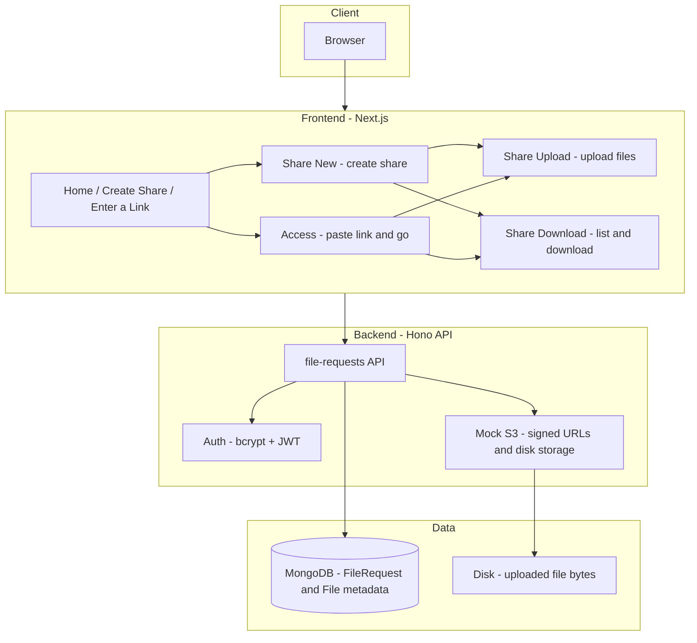

# File Upload / Download Service

A full-stack **share** service: create a share with two passwords (upload and download), get two links. Send the **upload** link to others so they can upload files; use the **download** link yourself to view and download everything. All access is password-protected. **MongoDB** is used for the database connection (metadata for file requests, shares, and files). Storage is file-based (no real S3): the backend issues signed URLs and stores files on disk.

## What it does

- **Create a share** – Set an upload password (for contributors) and a download password (for you). You get two URLs and can show/hide passwords and copy links with feedback.
- **Upload** – Anyone with the upload link and password can add files (drag-and-drop or browse). Status shows **percentage progress** per file; multiple files upload **in parallel**. Files over 5 MB use chunked multipart uploads.
- **Download** – You use the download link and your password to list and download all collected files. Uploaders can also download or delete their own uploads from the upload page.
- **Access by link** – The “Enter a link” page accepts a share URL (or legacy file-request URL, redirected to share) and takes you to the right place.

## How to run locally

### Prerequisites

- **Node.js** 18+
- **MongoDB** (e.g. [MongoDB Atlas](https://www.mongodb.com/cloud/atlas) or local)

### Backend

1. From the repo root:

   ```bash
   cd Backend
   npm install
   ```

2. Copy `.env.example` to `.env` and set at least:
   - `MONGODB_URI` – MongoDB connection string
   - `JWT_SECRET` – Secret for JWT signing  
   Optional: `PORT` (default 3001), `FRONTEND_ORIGIN` (e.g. `http://localhost:3000`), `BASE_URL`, `UPLOADS_DIR`.
3. Start the API:

   ```bash
   npm run dev
   ```

   API runs at **<http://localhost:3001>**.

### Frontend

1. In another terminal:

   ```bash
   cd Frontend
   npm install
   ```

2. Optional: create `.env.local` with `NEXT_PUBLIC_API_URL=http://localhost:3001` (default if omitted).
3. Start the app:

   ```bash
   npm run dev
   ```

   Open **<http://localhost:3000>**.

## Architecture



- **Share flow** – One concept: “Share”. Creating a share returns an **upload** URL and a **download** URL (and two passwords). Upload URL → password → upload/list/delete; download URL → password → list/download only. In spec terms: **file request** = the upload side (contributor link + password); **share** = the download side (viewer link + password) of the same collection.
- **Auth** – Passwords are hashed (bcrypt); minimum 8 characters for create-share. `POST /file-requests/:id/auth` (upload) or `.../auth-download` (download) returns a short-lived JWT for subsequent requests.
- **Rate limiting** – In-memory rate limit on file-requests: stricter limit on auth/create (20/15 min per client), general limit (100/15 min). Reduces brute-force and abuse.
- **Body limits** – JSON request bodies (file-requests) limited to 1 MB; mock-s3 upload and multipart part bodies limited to 100 MB.
- **Storage** – S3 is mocked. The backend generates “signed” URLs pointing at its own `/mock-s3` routes; file bytes live under `Backend/uploads` (or `UPLOADS_DIR`). Same API shape could be swapped for real S3 later.
- **Uploads** – Files &lt; 5 MB: one PUT to a signed URL. Larger files: multipart (init → part URLs → PUT each part → complete). The client shows upload progress (percentage) and runs uploads in parallel.
- **Graceful shutdown** – Backend disconnects MongoDB and closes the server on SIGTERM/SIGINT.
- **Code quality** – KISS, DRY, and SOLID: shared helpers (formatting, API response parsing), route middleware for auth/validation on the backend, and small hooks and components on the frontend.

## Tech stack

| Layer     | Tech |
|----------|------|
| Frontend | Next.js 15 (App Router), React 19, Tailwind CSS 4 |
| Backend  | Hono, TypeScript, Mongoose, bcrypt, JWT, Zod |
| Database | MongoDB (e.g. Atlas); collections: FileRequest, File |
| Storage  | Local disk (`Backend/uploads`); no AWS SDK |

## Project structure

```
├── Backend/          # Hono API: file-requests (share) + mock S3
│   ├── src/
│   │   ├── routes/   # fileRequests.ts, mockS3.ts
│   │   ├── models/   # FileRequest, File
│   │   ├── services/ # auth, mockS3
│   │   ├── middleware/  # auth, rateLimit, fileRequestAuth
│   │   ├── helpers/  # validation, objectId
│   │   ├── types/    # auth, api, mockS3
│   │   └── index.ts
│   ├── Dockerfile    # Railway-ready
│   └── .dockerignore
├── Frontend/         # Next.js app (standalone build)
│   ├── src/
│   │   ├── app/      # home, share/new, share/[id], share/[id]/download, access
│   │   ├── helpers/   # api (createAuth, uploadApi, uploadWithProgress, filesApi, parseResponse), formatting (formatSize)
│   │   ├── hooks/    # useFileList, useShareAuth
│   │   ├── types/    # api (API response types)
│   │   ├── shared/ui/    # Button, Input, PasswordInput, ErrorBoundary
│   │   └── widgets/  # PasswordForm, UploadZone, FileList, Header, Footer
│   ├── Dockerfile    # Railway-ready
│   └── .dockerignore
└── README.md
```

## API overview (Backend)

All share functionality is under **file-requests**:

- **Create** – `POST /file-requests` (body: `uploadPassword`, `downloadPassword`, optional `name`). Returns `uploadLink`, `downloadLink`, and the two passwords (for display/copy).
- **Auth** – `POST /file-requests/:id/auth` (upload), `POST /file-requests/:id/auth-download` (download). Body: `password`. Returns `token` (JWT).
- **Upload** – `POST /file-requests/:id/upload-url`, `POST /file-requests/:id/upload-complete`; multipart: `.../multipart/init`, `.../part-url`, `.../complete`.
- **Files** – `GET /file-requests/:id/files`, `GET /file-requests/:id/download-url/:fileId`, `DELETE /file-requests/:id/files/:fileId`.

**Mock S3** (used via signed URLs): `PUT /mock-s3/upload`, `GET /mock-s3/download`, `PUT /mock-s3/multipart/part`.

## Version

1.4.0

## Changelog

- **1.4.0** (January 2025) – Upload progress: status shows percentage per file (XHR for single PUT, part-based for multipart). Uploads run in parallel (Promise.all). New helper `putWithProgress` in Frontend.
- **1.3.0** (January 2025) – Frontend DRY: shared `formatSize` helper (formatting), `parseJsonResponse`/`throwIfNotOk` (api/parseResponse), `useShareAuth` hook for share pages. Backend DRY: `fileRequestAuth` middleware (requireValidRequestId, requireUploader, requireViewer) for id validation and role checks. READMEs updated with code-quality notes.
- **1.2.0** (January 2025) – Backend: rate limiting (auth/create vs general), body size limits (1 MB JSON, 100 MB uploads), MongoDB ObjectId validation for `:id`/`:fileId`, minimum password length 8 for create-share, graceful shutdown (SIGTERM/SIGINT). Types: auth, api, mockS3. Frontend: types for API responses and errors, ErrorBoundary in layout, PasswordForm loading on share pages, API helpers split into createAuth/uploadApi/filesApi, Button typo fix (`orientation`).

## Last updated

January 29, 2025
